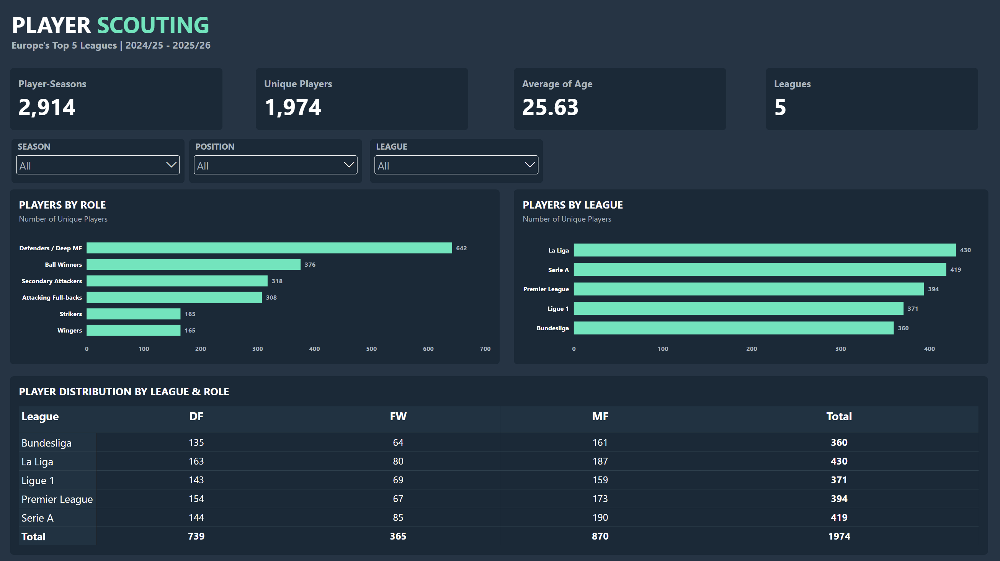

# Player Scouting & Transfer Value Tool

A Python and Power BI project for analysing and scouting outfield football players across Europe's Big 5 leagues: the Premier League, La Liga, Serie A, Bundesliga and Ligue 1.



The project uses player performance data from the 2024/25 and 2025/26 seasons to identify player roles, find statistically similar players and compare estimated market value with actual market value.

## Project Overview

The project combines:

* **Player performance analysis** using per-90 statistics
* **K-means clustering** to identify six playing-style roles
* **Player similarity analysis** to find potential replacements
* **Transfer shortlisting** using performance, age, contract and market-value filters
* **Market value modelling** using Ridge Regression
* **Power BI dashboards** for interactive scouting and analysis
* **Club badges** to improve dashboard presentation

The final Power BI dashboard contains four pages:

1. Role Overview
2. Player Profiles
3. Transfer Value Shortlist
4. Similar Player Finder

## Key Results

* ~2,900 outfield player-seasons analysed
* Six style-based player roles identified
* Similarity searches can compare players across leagues and positions
* Market value model achieved an out-of-fold **R² of 0.78**
* Role assignments showed reasonable stability across seasons
* Club strength was an important predictor of market value

The market value model is intended to identify **potential scouting leads**, rather than provide definitive player valuations.

## Methodology

### Player Features

The main performance features include:

* Goals per 90
* Assists per 90
* Shots per 90
* Crosses per 90
* Interceptions per 90
* Tackles won per 90

Players were filtered to those with at least **900 minutes**.

### Role Clustering

K-means clustering was used to group players into six statistically similar playing styles.

The clusters were interpreted using football-related role descriptions such as:

* Strikers
* Wingers / wide creators
* Mixed secondary attackers
* Attacking full-backs / wing-backs
* Ball-winning midfielders
* Low-event defenders / deep midfielders

### Player Similarity

Players are compared using their standardised performance profiles. The tool can identify statistically similar players and apply filters such as:

* Age
* League
* Position
* Sub-position
* Market value
* Contract length
* Height

### Market Value Model

A Ridge Regression model predicts log market value using player performance, age and club strength.

The model achieved:

* **Out-of-fold R²: 0.78**
* **Typical prediction error: ~1.56×**

Results should be interpreted as scouting signals rather than precise valuations.

## Data Sources

| Source                 | Data                                                   |
| ---------------------- | ------------------------------------------------------ |
| FBref / Kaggle         | Player performance statistics                          |
| Transfermarkt datasets | Market value, contracts, height, foot and sub-position |
| football-logos         | Club badge images                                      |

Market value and contract information represents a snapshot of the available Transfermarkt data rather than live information.

## Power BI

The Python pipeline exports the analysis into a single Excel workbook containing the tables used by Power BI.

Club badge URLs are categorised as **Image URL** fields so that club crests can be displayed throughout the dashboard.

## Data Quality & Limitations

Several limitations were identified during the project:

* Some FBref advanced statistics were unavailable for these seasons.
* `fouls_drawn` and `offsides` were excluded because of data-quality issues.
* Player position labels can change between seasons.
* Club badges require a manually maintained team-name mapping.
* Market value reflects market conditions and factors that are not captured by the model, such as reputation, potential and injury history.
* Goalkeepers are excluded from the current clustering and similarity analysis.
* Crosses can include set-piece deliveries, which may affect the classification of some midfielders.

## Repository Structure

```text
data/
├── raw/
├── processed/
└── powerbi/

models/
└── clustering.joblib

src/
├── clean_data.py
├── create_player_features.py
├── prepare_clustering.py
├── join_transfermarkt.py
├── value_model.py
├── similarity.py
├── shortlist.py
├── export_for_powerbi.py
└── build_powerbi_workbook.py
```

## Setup

```bash
python3 -m venv venv
source venv/bin/activate
pip install -r requirements.txt
```

Raw datasets are not included in the repository and must be downloaded separately.

## AI Usage

AI tools were used as a supporting resource during development for:

* Debugging Python, DAX and Power BI
* Troubleshooting errors
* Exploring analytical approaches
* Improving documentation and project structure

The data processing, analysis, modelling, dashboard development and final project decisions were reviewed and implemented by me.
